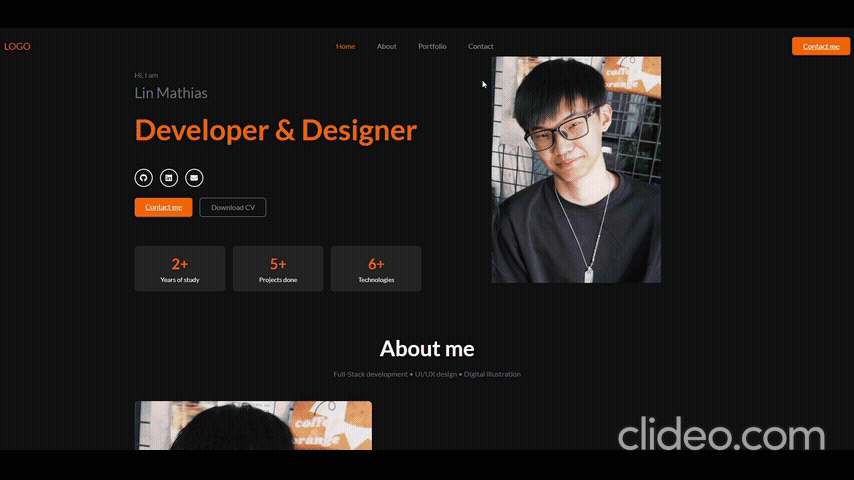
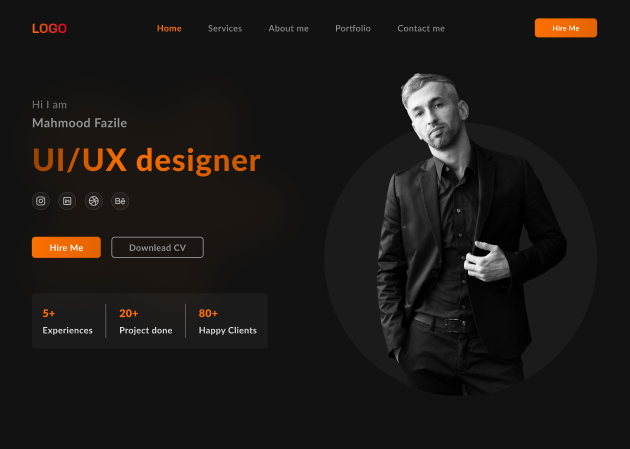
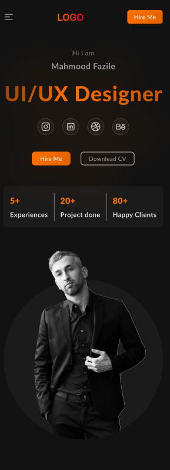

# Portfolio Personnel 

## Informations personnelles
Bonjour je me nomme Lin Mathias et je vous presente mon projet de portfolio personnel web responsive avec Bootstrap dans le cadre de la formation 2FCSS

---

## Aperçu du projet

### Version Desktop

**home et hero section preview :** 


**portfolio preview :**


**contact preview :**


### Version mobile


> *Note : Les gifs sont disponibles dans le dossier `/asset_README`*

---

## Maquette Figma utilisée

**Lien vers la maquette :** [Figma](https://www.figma.com/design/eLGA2dKcav5Cb5OifRqOF6/Personal-website-%7C-Portfolio--Community-?node-id=587-638&p=f&t=pCR4N5NAAkUNYPcM-0)

### Captures de la maquette originale




Cette maquette est sobre/élégant et professionnel d'où mon choix vers cette maquette


---

## Technologies utilisées

### Langages
- **HTML** - Structure du site
- **CSS** - Styles personnalisés de la maquette et animations
- **JavaScript** - Interactions et smooth scroll

### Framework CSS
- **Bootstrap 5.3.8** - Framework pour la mise en page responsive

### Bibliothèques externes
- **Font Awesome** - Icônes (réseaux sociaux, services)
- **Google Fonts** - Typographie specifique de la maquette

### Hébergement
- **GitHub Pages** - Déploiement du site 

---

## Installation et lancement en local

### Prérequis
- **Node.js** et **npm** installés
- Un navigateur web (Chrome, Firefox, Safari, Edge, ...)
- Un éditeur de code (VS Code recommandé car plus simple)

### Étapes d'installation

1. **Cloner.copier le dépôt Git**
```bash
git clone https://github.com/Wendybest912/CSS-Framework.git
cd CSS-Framework
```

ou télécharger tout simplement tous les fichiers dans un meme dossier 


4. **Lancer le projet**

**Option A : Avec Live Server (recommandé)**
- Installer l'extension "Live Server" dans VS Code
- Clic droit sur `index.html` → "Open with Live Server"
- Le site s'ouvre sur votre navigateur web


**Option B : Directement dans le navigateur**
- Double-cliquer sur `index.html` pour l'ouvrir sur le navigateur

---

## Déploiement en ligne

### Lien du site : [https://wendybest912.github.io/CSS-Framework/](https://wendybest912.github.io/CSS-Framework/)

### Méthode de déploiement:


Le site est hébergé sur **GitHub Pages**
---

## Contact

**Email :** lin.mathias@gmail.com  
**LinkedIn :** [linkedin.com/in/wendybest](https://www.linkedin.com/in/mathias-lin-027695356/)  
**GitHub :** [github.com/Wendybest912](https://github.com/Wendybest912/CSS-Framework)  
**Portfolio :** [wendybest912.github.io/CSS-Framework](https://wendybest912.github.io/CSS-Framework/)

---

## Licence

Ce projet est réalisé dans un cadre pédagogique pour l'école Hexagone pour la formation 2FCSS.  
© 2025 Mathias Lin - Tous droits réservés.

---